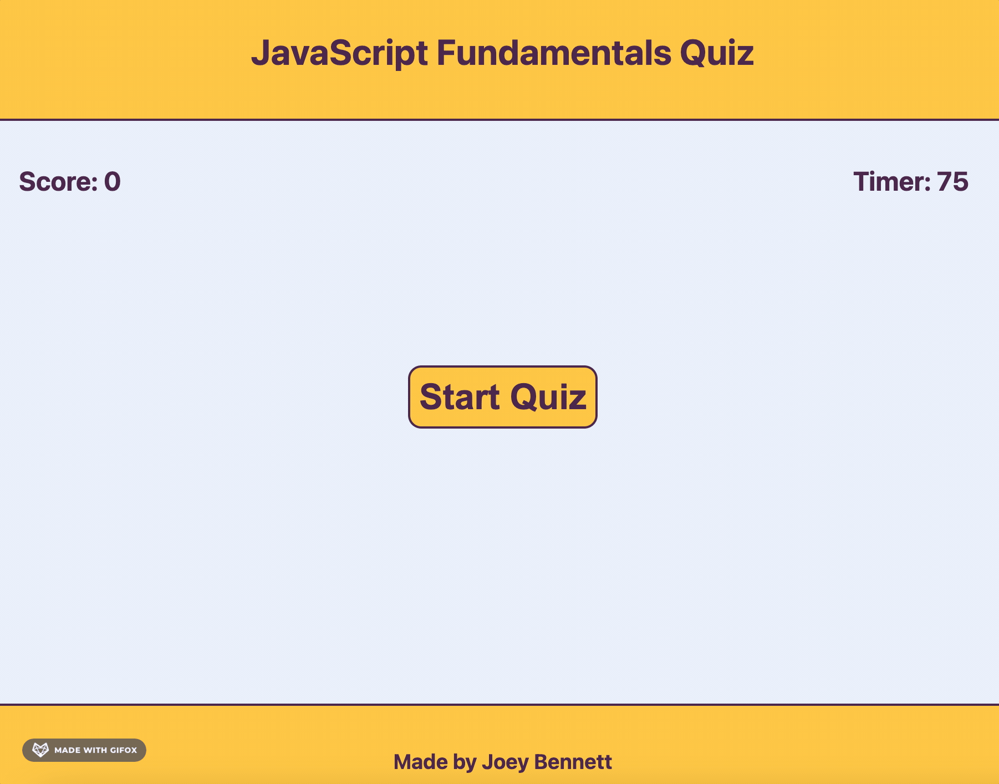
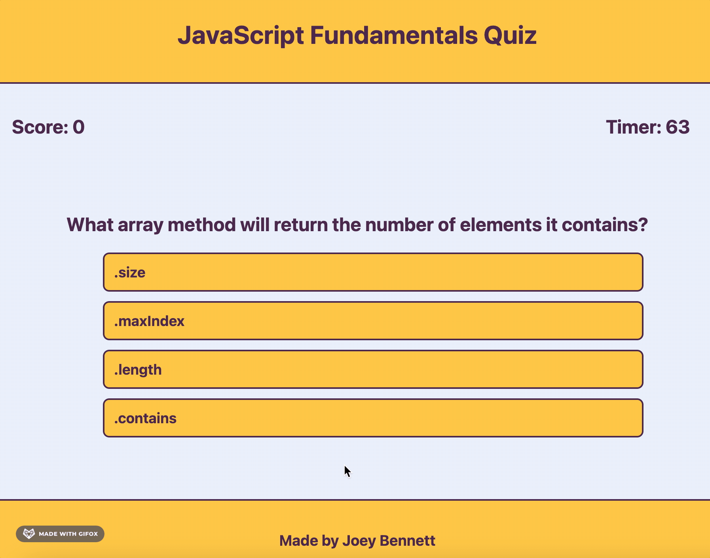
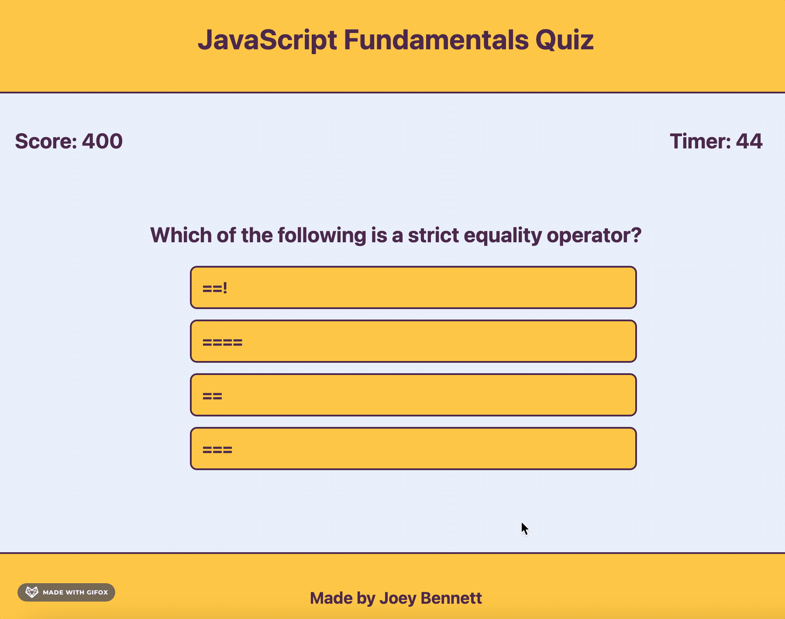

# **JavaScript Fundamentals Web Quiz**

---

Welcome to the **JavaScript Fundamentals Web Quiz**!!

## **Take the Quiz!**

---
Are you a JavaScript expert? Let's find out! [This JavaScript quiz]() tests your knowledge on JavaScript with 10 multiple choice questions. 

## **How Does it Work?**

---
You can visit the site [here]().

When you visit the site you will be prompted to start the quiz with a large yellow button in the center of the page. You have 75 seconds to complete the quiz.

You will receive 50 points for every correct answer, and lose 10 seconds off the timer for every incorrect answer.

Once you have either completed all the questions or run out of time, you will be prompted to enter your initials to save your high score!

Keep on trying until you get them all correct!

## **About the Author**

---
Hi there- my name is Joey Bennett and I am a Jr. Web Dev learning JavaScript with projects like this one! 

Below this I have some extra notes on the code I used to make this work for those of you interested in that sort of thing! 🤓

If you're interested in connecting with me please feel free to visit/reach out to me on any of the following sites:

* [GitHub](https://github.com/coderbennett)
* [LinkedIn](https://www.linkedin.com/in/joey-bennett-jkb/)
* [Twitter](https://twitter.com/joeykalanchoe)
* [Portfolio](https://coderbennett.github.io/portfolio-flat/)

## **Extra Notes**

---

In this section I will preview some code snippets I found the most interesting and/or fun to work on with this project.

### **Using Local Storage**

When using local storage, it is important to remember that everything stored there must be a string. In this case we are using the JSON.stringify method to update the highscores object.

    localStorage.setItem("highScores", JSON.stringify(highScores));

Without the stringify method, the local storage would not be able to store the variable properly.

To continue on an important note with using local storage, when taking data from local storage we must parse it to "unstringify" in our case the highscores array with objects.

    highScores = JSON.parse(localStorage.getItem("highScores"));

### **Generating HTML Elements with JavaScript**

A tricky part of this project was creating the list of highscore stats. This is because we cannot know how many highscores will be stored at any one time and we must make it responsive to that number. Luckily, we have iterators like for loops to tackle this problem.

    for (var i = 0; i < highScores.length; i++) {

    liArray[i] = document.createElement("li");

    highscoresEl.appendChild(liArray[i]);

    liArray[i].textContent = highScores[i].initials + ": " + highScores[i].highscore;
    }

This for loop checks our highscores array to see how many highscores have been saved, then creates an HTML element for each of them, appends those as children to the highscores list element, and lastly sets text content for those elements.